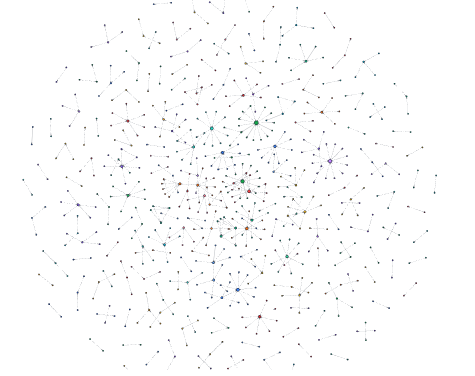

A Picture of the visulization of neo4j db something like that

## To Execute
Q1 To Extract From Wiki and Investopedia

python extractor.py

Q2 & Q3
Open neo4j, python q2.py & python q3.py

Visualizations
streamlit run app.py
http://localhost:8501


### File Descriptions

- **`medium/Extractor/FinCatch_Sources_Medium.csv`**  
  Source list for Q1. Each row tells the extractor **where to fetch**:
  - Columns: `source` (e.g., `wiki`, `investopedia`), `url`
  - Drives routing inside `extractor.py`

- **`medium/Extractor/extractor.py`**  
  Orchestrator for Q1 (read → fetch → parse → normalize → write):
  - Reads `FinCatch_Sources_Medium.csv` and routes per `source`
  - Calls site-specific parsers (`wikipedia.py`, `investopedia.py`)
  - Handles retries/timeouts and exceptions
  - Writes successes to `output.json`, failures to `errors.json` (same schema)

- **`medium/Extractor/wikipedia.py`**  
  Wikipedia parser producing a **unified record**:
  - Extracts `title`, `sections` (`{heading, level, text}`), `full_text`
  - Generates a short `summary` via `llm_summarizer.py`

- **`medium/Extractor/investopedia.py`**  
  Investopedia parser with the **same unified record**:
  - Browser-like headers, retry + AMP fallback
  - Parses body into `sections` / `full_text`
  - Calls `llm_summarizer.py` for `summary`

- **`medium/Extractor/llm_summarizer.py`**  
  Lightweight summarization helper:
  - `summarize_and_log(text, title="", max_words=120)`

- **`medium/Extractor/output.json`**  
  **Successful** extractions keyed by URL (input to Q2/Q3).
  ```json
  {
    "title": "Return on equity",
    "sections": [{"heading": "Usage", "level": 2, "text": "..."}],
    "full_text": "...",
    "summary": "..."
  }

- **`medium/Causal/q2.py`**  
  Load output.json, Split Sentences, put to neo4j
- **`medium/Causal/.`**
  Pretty Straight Forward I believe.......


# Approch
Use the wikipedia api: https://pypi.org/project/Wikipedia-API/

BeautifulSoup for Investopedia

facebook/bart-large-cnn for summary as I am poor for using api and bart is great when doing summarization

As the full context is sooooo long, therefore try to seperate them into sections


Put them into the neo4j db, as the /causal/q2.py does

This is the very first time I heard about the neo4j db

# Answering Question
- ## Challenges
- Data Extraction
  - Challenge: Heterogeneous pages (wiki and investopedia) and anti-bot measures which break parsers
  - Mitigation: Real Headers, retries/timeouts
- Causal Relationship Visualizer
  - Challenges: The Very First Time Using neo4j, learn from very beginning, Defining Rule Pattern, some it goes with all
  node and no edge, or only few node or few edge
  - Mitigation: Cue Lexicons, noun-phrase normalization, pronoun, evidence aggregation per(c1,c2) using count and conf
- Clustering
  - Challenge: Bias to Structure or text
  - Mitigation: Two views—(a) Louvain community on weighted graph; (b) Node2Vec + TF-IDF→SVD embeddings + KMeans with silhouette-based K selection
- Visulization
  - Challenge: Graphs can be dense
  - Mitigation: Streamlit
- ## Future Directions
- Enrich data & temporal grounding
  - Idea: Add SEC 10-K/10-Q, earnings calls, central-bank statements, macro time series (rates, CPI), prices/fundamentals; entity & time alignment to concepts.
  - Implementation: ETL connectors → sentence-level evidence linked with dates/tickers; edges carry recency/source weights.
  - Feasibility: High—public sources exist; main work is normalization.
- Real-time pipeline
  - Idea: Stream news/filings to incremental extractors; maintain decaying evidence.
  - Implementation: Kafka topics → Flink/Spark Streaming → Neo4j Sink; windowed aggregation, per-edge time decay.
  - Feasibility: Medium—standard infra, moderate ops cost.
- Better causality
  - Idea: RAG-assisted causal extraction; weak-supervision classifier to filter rule hits; temporal Granger checks for macro-tied edges.
  - Feasibility: Medium—LLM cost/latency vs. gains; temporal tests are tractable.

To Be Simple, this is just a very small work that use basic finance concept, what the future can do is to enrich
the dataset, the ways to prepare data, and make structural data, richer data and streaming and predictive modeling.
Real world streaming data leads to money.